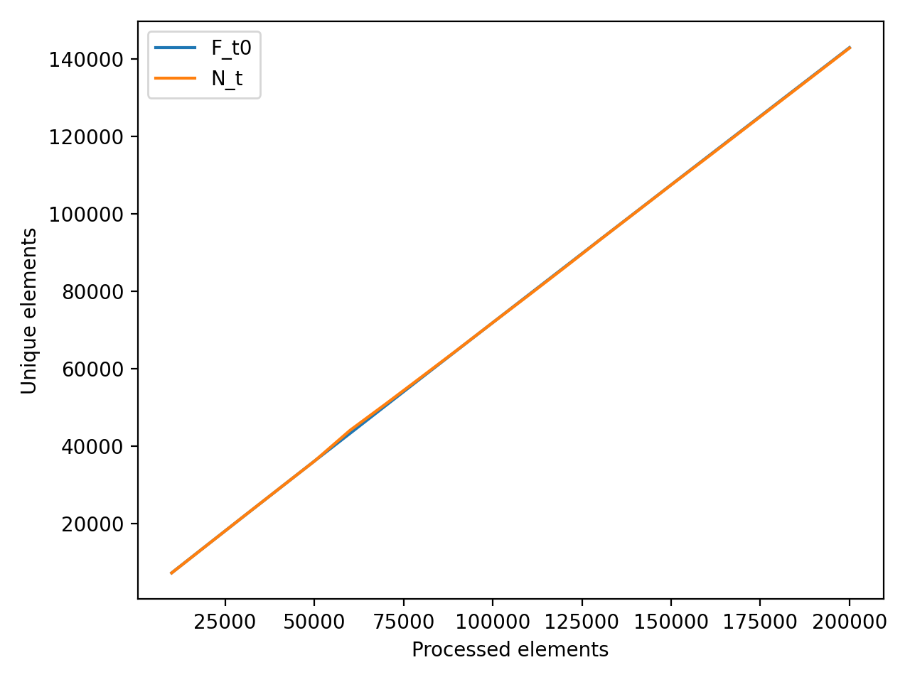
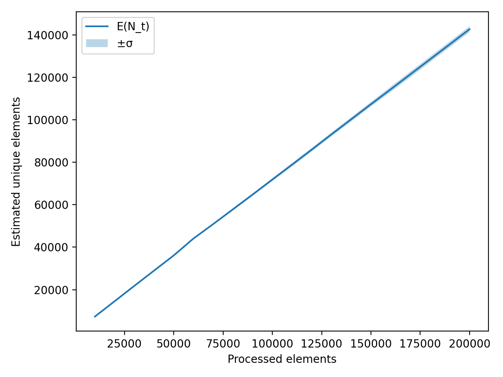

# A3 HyperMegaLogLog Pro Max++

## Параметры эксперимента
Хеш-диапазон: 2^32. Индексация: первые B бит хеша, m=2^B регистров.
Выбрано B=14 (m=16384): теоретическая относительная стандартная ошибка RSE≈1.04/√m=1.04/128=0.8125%.
Данные: 30 потоков по 200000 строк, разбиение на 20 шагов (5%), вероятность повтора 0.25.

## Этап 1. Инфраструктура
RandomStreamGen: строки длиной 1..30 из [a-zA-Z0-9-], разбиение потока на равные части.
HashFuncGen: полиномиальный хеш + линейное преобразование и финализация splitmix64, выход uint32_t.

## Этап 2. Реализация HyperLogLog
Регистры: j = первые B бит хеша, w = оставшиеся биты, обновление R[j]=max(R[j], rho(w)), rho — позиция первого 1 (1..(32-B+1)).
Оценка: E = alpha_m * m^2 / sum(2^(-R[j])).
Коррекции: linear counting при E≤2.5m и V>0 (V — число нулевых регистров), large-range correction при E>2^32/30.

График 1: Ft0 и N_t (среднее по потокам).
График 2: E(N_t) и область E(N_t)±σ (σ — выборочное std по потокам).

## Этап 3. Анализ точности
Финальный шаг (200000 элементов):
mean(Ft0)=142907.2, mean(N_t)=142798.1, смещение=-0.076%.
σ(N_t)=1364.7, относит. σ/mean(Ft0)=0.955%.
Сравнение с теориями: 1.04/√m=0.8125%, 1.3/√m=1.016% (эмпирическое значение между ними).

## Этап 4. Опционально: оптимизация памяти
Версия HyperLogLog32Packed: упаковка регистров по 6 бит.
Память стандартной версии: 16384 байт.
Память упакованной версии: 12296 байт, экономия ~25.0%.
